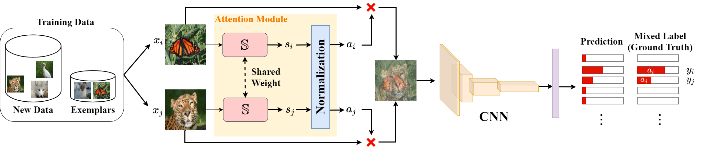

# Data Efficient Incremental Learning Via Attentive Knowledge Replay (IEEE SMC 2023)
Official PyTorch implementaton of IEEE SMC 2023 paper "[Data Efficient Incremental Learning Via Attentive Knowledge Replay](https://people.cs.nycu.edu.tw/~walon/publications/lee2023smc.pdf)".  
You can visit our project website [here](https://yilunlee.github.io/Attentive_Replay_IL/).

## Introduction
lass-incremental learning (CIL) tackles the problem of continuously optimizing a classification model to support growing number of classes, where the data of novel classes arrive in streams. Recent works propose to use representative exemplars of learnt classes, and replay the knowledge of them afterward under certain memory constraints. However, training on a fixed set of exemplars with an imbalanced proportion to the new data leads to strong biases in the trained models.
In this paper, we propose an attentive knowledge replay framework to refresh the knowledge of previously learnt classes during incremental learning, which generates virtual training samples by blending between pairs of data. Particularly, we design an attention module that learns to predict the adaptive blending weights in accordance with their relative importance to the overall objective, where the importance is derived from the change of the image features over incremental phases. Our strategy of attentive knowledge replay encourages the model to learn smoother decision boundaries and thus improves its generalization beyond memorizing the exemplars. We validate our design in a standard class-incremental learning setup and demonstrate its flexibility in various settings.

<div align="center">
  
</div>

## Usage
### Enviroment
#### Prerequisites
#### Other requirements
```

```

### Prepare Dataset


### Evaluation
```
 
```

### Train
1. 
```

```


## Citation
If you find this work useful for your research, please cite:
```Bibtex
@inproceedings{lee2023smc,
 title = {Data Efficient Incremental Learning Via Attentive Knowledge Replay},
 author = {Yi-Lun Lee and Dian-Shan Chen and Chen-Yu Lee and Yi-Hsuan Tsai and Wei-Chen Chiu},
 booktitle = {IEEE International Conference on Systems, Man, and Cybernetics (SMC)},
 year = {2023}
}
```

## Acknowledgements
This code is based on [link]().
